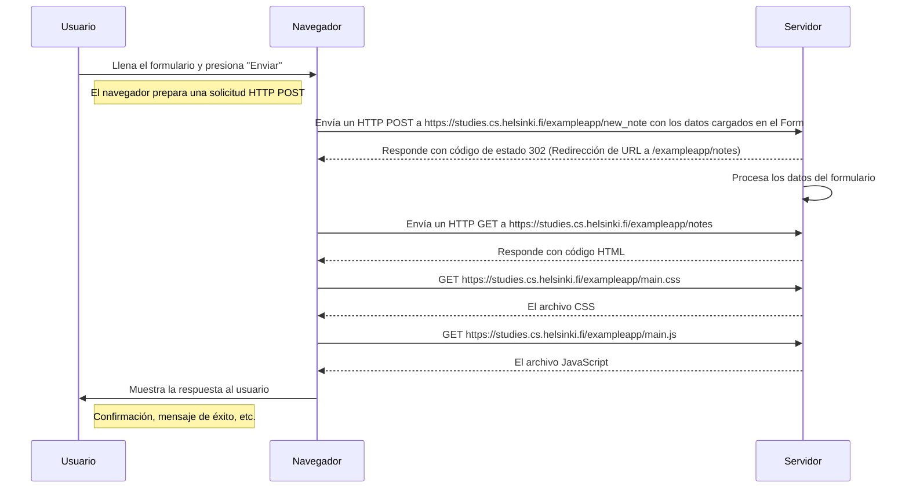

# Comunicación HTTP usando el método POST

Este documento describe el flujo de comunicación cuando se envía un formulario desde el front-end al back-end usando el método POST.

```mermaid
sequenceDiagram
    participant Usuario
    participant Navegador
    participant Servidor

    Usuario ->> Navegador: Llena el formulario y presiona "Enviar"
    Note right of Usuario: El navegador prepara una solicitud HTTP POST
    
    Navegador ->> Servidor: Envía un HTTP POST a https://studies.cs.helsinki.fi/exampleapp/new_note con los datos cargados en el Form
    Servidor -->> Navegador: Responde con código de estado 302 (Redirección de URL a /exampleapp/notes)
    
    Servidor ->> Servidor: Procesa los datos del formulario

    Navegador ->> Servidor: Envía un HTTP GET a https://studies.cs.helsinki.fi/exampleapp/notes
    Servidor -->> Navegador: Responde con código HTML

    Navegador ->> Servidor: GET https://studies.cs.helsinki.fi/exampleapp/main.css
    Servidor -->> Navegador: El archivo CSS
    
    Navegador ->> Servidor: GET https://studies.cs.helsinki.fi/exampleapp/main.js
    Servidor -->> Navegador: El archivo JavaScript
 
    Navegador ->> Usuario: Muestra la respuesta al usuario
    Note right of Usuario: Confirmación, mensaje de éxito, etc.
```
